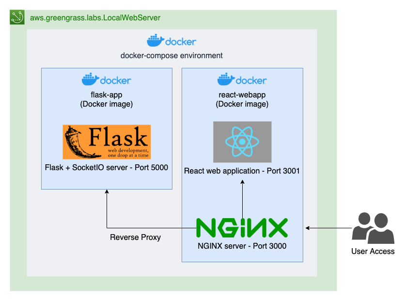
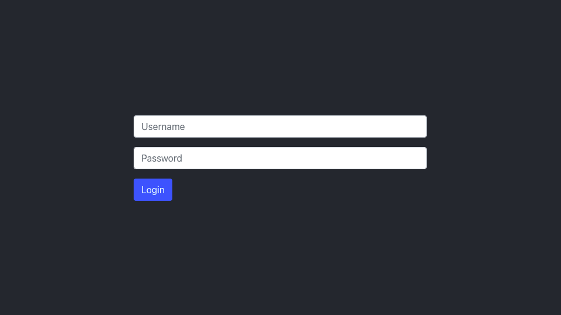
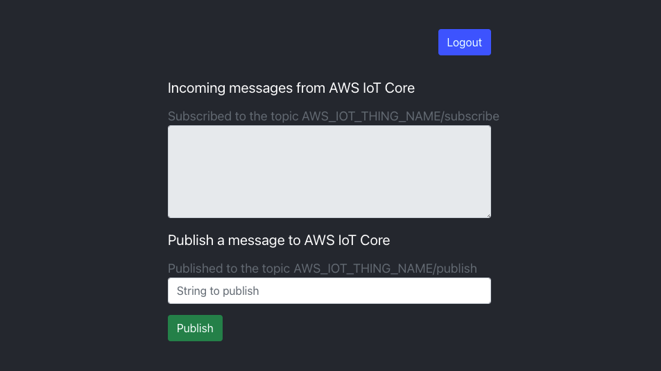

# aws.greengrass.labs.LocalWebServer

This repository contains code artifacts deploying an interactive local web server hosted on a Linux-based Greengrass v2 device.

This component demonstrates how to implement a local web server on Greengrass v2.  Some industrial IoT solutions require customers to have a HMI (human machine interface) to visualize/interact with the state of the device(s). This implementation includes a Flask (Python) backend, and a React (JavaScript) frontend. The aws.greengrass.labs.LocalWebServer component shows how Flask + SocketIO can be integrated with the (Python) AWS IoT Device SDK for interprocess communication (IPC) on Greengrass v2. With a Flask + SocketIO application integrated with Greengrass IPC, a process using the SocketIO client can access the MQTT broker (via proxy) over SocketIO.  A basic [create-react-app](https://github.com/facebook/create-react-app) application using the JavaScript SocketIO client can publish/subscribe messages to the Flask + SocketIO server, which acts as a bridge to the local MQTT broker on Greengrass.

## Architecture

### Component

There are three artifacts included in this component: a docker-compose.yaml file, and two Docker images for each the React application and the Flask+SocketIO application.  When docker-compose up is executed (as defined in the Greengrass component recipe), both containers are initialized and a local network is created - the Flask+SocketIO application is exposed over port 5000, while the React application is exposed over port 3000. In addition, a NGINX server is included in the React app Docker image, for serving the React application, and providing a reverse proxy for all API calls to the Flask+SocketIO container.



## Requirements
### AWS IoT Greengrass v2

If you haven't already installed the Greengrass v2 runtime on your device, you can follow the tutorial [here](https://docs.aws.amazon.com/greengrass/v2/developerguide/getting-started.html).

### Docker

On the Greengrass v2 core device, the following must be installed:
    
* [Docker](https://docs.docker.com/get-docker/)
* [docker-compose](https://docs.docker.com/compose/install/)
    

### Create secret in AWS Secrets Manager

First, we need to provide a username and password for authenticating into local web server on the device. Make sure to take note of the ARN for deployment!

> NOTE: you will need the [AWS CLI](https://docs.aws.amazon.com/cli/latest/userguide/cli-chap-getting-started.html) installed to run the following commands. You can optionally create this secret in the AWS Management Console instead

> NOTE: make sure you close this terminal session after the tutorial to protect your password.

> NOTE: in macOS, run `bash` before running the following commands.

```console
read -s -p "Enter user:" LOCALWEBSERVER_USER
read -s -p "Enter password:" LOCALWEBSERVER_PASSWORD
aws secretsmanager create-secret --name localwebserver_credentials
aws secretsmanager put-secret-value --secret-id localwebserver_credentials --secret-string "{\"username\":\"$LOCALWEBSERVER_USER\",\"password\":\"$LOCALWEBSERVER_PASSWORD\"}"
```

## Dependencies

When you deploy a component, AWS IoT Greengrass also deploys compatible versions of its dependencies. This means that you must meet the requirements for the component and all of its dependencies to successfully deploy the component. This section lists the dependencies for the released versions of this component and the semantic version constraints that define the component versions for each dependency. You can also view the dependencies for each version of the component in the [AWS IoT Greengrass console](https://console.aws.amazon.com/greengrass). On the component details page, look for the Dependencies list.

### 1.0.0

| Dependency | Compatible versions | Dependency type |
|---|---|---|
| aws.greengrass.Nucleus | >=2.4.0 | Soft |
| aws.greengrass.SecretManager | >=2.0.9 | Soft |

## Build and publish Greengrass component

### Update the GDK configuration file

Update the **bucket** and **region** values in **gdk-config.json** to values of your choosing.

### Add a SSL certificate/key 

The front-end Docker image in this Greengrass component uses SSL, and expects both a certificate and key at build-time.

If you already have a valid SSL certificate and key for your web server, rename to **ssl.crt** and **ssl.key**, and copy both to **src/frontend**.

If you need a temporary SSL certificate and key for development purposes only, follow the instructions below.

First, we need to create a certificate authority that we will use to sign SSL certificates for localhost development/debugging. For a production environment, you should acquire/purchase a certificate verified by a trusted certificate authority.

> NOTE: the following -subj arguments can be modified, and are example values only

```console
openssl genrsa -out localhostRootCA.key 2048
openssl req -x509 -new -nodes -key localhostRootCA.key -sha256 -days 3650 -out localhostRootCA.crt -subj "/C=US/ST=Washington/L=Seattle/O=Localhost Signing Authority/CN=Localhost Signing Authority"
```

Next, we will create a SSL certificate and key using the previously created certificate authority and the parameters configured in **req.conf**.

> NOTE: the values in req.conf can be modified, and are example values only

```console
openssl req -new -sha256 -nodes -newkey rsa:2048 -keyout ssl.key -out ssl.csr -config req.conf
openssl x509 -req -in ssl.csr -CA localhostRootCA.crt -CAkey localhostRootCA.key -CAcreateserial -out ssl.crt -sha256 -days 3650 -extfile req.conf -extensions v3_ca
```

Lastly, copy both **ssl.crt** and **ssl.key** to **src/frontend**.

If you needed to create a development certificate authority, you need trust this certificate authority (the localhostRootCA.crt file) in your device browser (i.e. in Chrome, go to **Settings > Privacy and security > Security > Manage Certificates** to import a new certificate authority.  You will only need to import this certificate authority once per device.

### Run GDK commands

```console
gdk component build
```

```console
gdk component publish
```

## Configure and update Greengrass deployment

### Update IAM role for Greengrass role alias

You will need to grant permissions for the IAM role to read from the S3 bucket with your component(s), and also read the secret created in AWS Secrets Manager.

### Navigate to AWS IoT Greengrass & Deployments

In the AWS Management Console, navigate to AWS IoT Greengrass, and click **Deployments**

Notice the different deployments that are listed - one for the specific Core device, and another for the Thing group that the Core device is associated to. Click **Deployment for YOUR_GROUP_NAME**.
 
### Revise an existing Deployment

Notice the IoT Job featured at the top - this is responsible for continuously deploying this deployment configuration out to associated targets. Click Revise to update the deployment.

If prompted, click **Revise Deployment**.

In **Step 1 - Specify Target**, click **Next**.

### Add component

Unselect **Show only selected components** under **My Components** and **Public Components**. Then make sure the following components are checked:

* aws.greengrass.labs.LocalWebServer
* aws.greengrass.SecretManager

Then, click Next.

### Finish deployment

In **Step 3 - Configure components**, select **aws.greengrass.SecretManager**, and click **Configure component**.

In **Configuration to merge**, paste the following JSON with your secret ARN for the local web server (from previous instruction). Then click **Confirm**.

```json
{ "cloudSecrets": [{ "arn": "arn:aws:secretsmanager:REGION:ACCOUNT:secret:localwebserver_credentials-SUFFIX" }] }
```

In **Step 4 - Configure advanced settings**, click **Next**.

In **Step 5 - Review**, click **Deploy**.

## Using the component

### Navigate to AWS IoT MQTT test client

* In the AWS Management Console, navigate to AWS IoT, and click **Test >> MQTT Test client**
* Enter **#** in **Subscription topic** and click **Subscribe to topic**
* You should see different state/actions information being published in console below when interacting with React application.

### Edge device interaction

On the device, open the url **https://localhost:3000** in a browser (i.e. Chromium). You will be prompted to login with the credentials you stored in AWS Secrets Manager:



After logging in, you can see incoming messages that were published on the topic **<AWS_IOT_THING_NAME>/subscribe**, and you can also publish messages to **<AWS_IOT_THING_NAME>/publish**

> NOTE: Login sessions are configured to last for 15 minutes by default. You will automatically be logged out after this duration has passed.



## Testing

## PyTest + Coverage

Make sure you have the following packages installed:

```console
pip install pytest pytest-mock pytest-cov flask-socketio flask-login awsiotsdk
```

Then run the following to get coverage tests on the backend application that will run on the device:

```console
pytest --cov=src/ --cov-report=html
```

## Changelog

The following table describes the changes in each version of the component.

| Version | Changes |
|---|---|
| 1.0.0 | Initial version |

## Security

See [CONTRIBUTING](CONTRIBUTING.md#security-issue-notifications) for more information.

## License

This project is licensed under the Apache-2.0 License.


